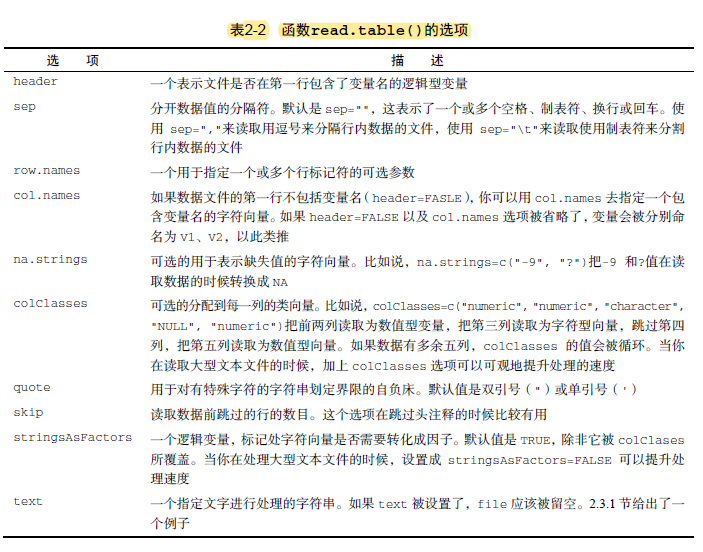

# 数据结构
## 矩阵创建matrix()
|参数|作用|
| :---: | :---: |
| vector | 元素 |
| nrow&ncol= | 行和列的维数 |
| byrow= | FALSE 按列填充，TRUE 按行填充 |
|dimnames=list()|行名和列名|
## 数据框创建data.frame()
data.frame()后直接接上各个变量作为其数据，而实际上以变量名作为列名

数据框读取用datasetNAME$variableNAME
## 因子factor()
举例来说，假设有向量：
diabetes <- c("Type1", "Type2", "Type1", "Type1")

语句diabetes <- factor(diabetes)将此向量存储为(1, 2, 1, 1)，并在内部将其关联为
1=Type1和2=Type2（具体赋值根据字母顺序而定）

|参数|作用|
|:---:|:---:|
|levels|指定类别的顺序和全集|
|labels|给类别重命名|
|ordered||
# 文件读取
## read.table()

